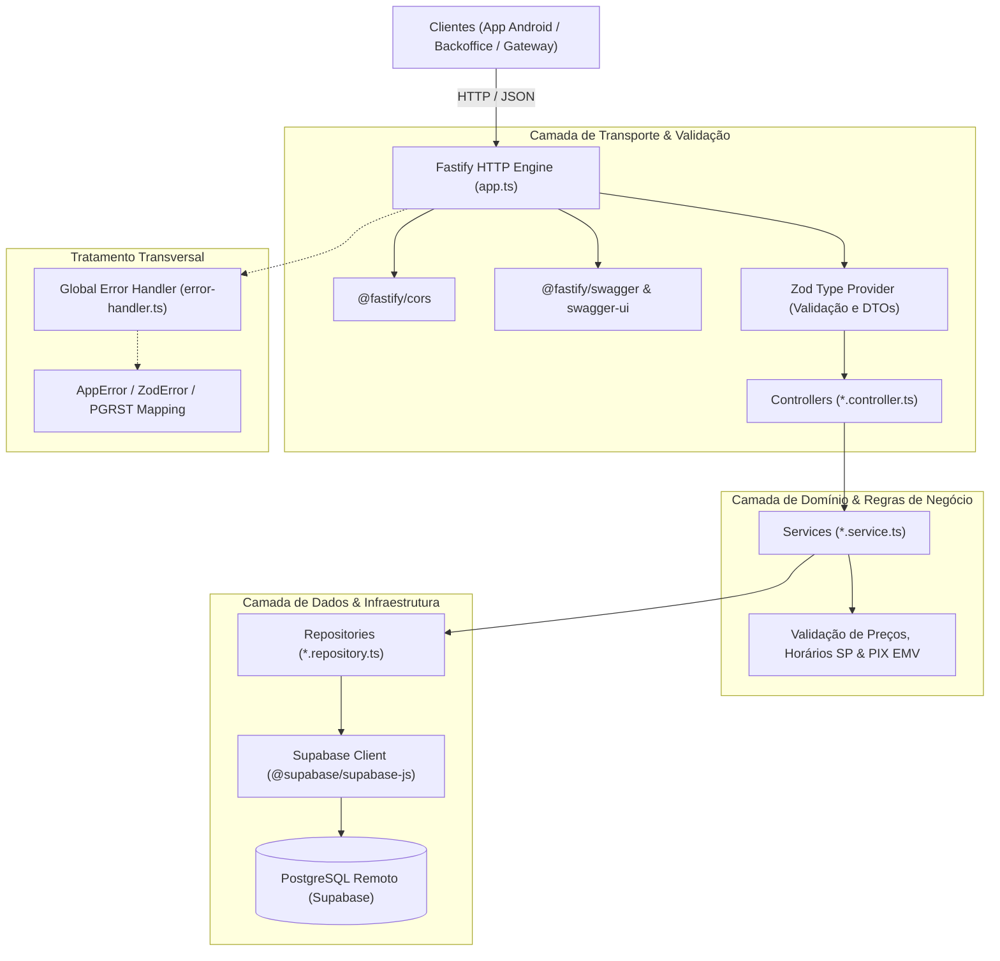

# Arquitetura do Sistema - Marmitex Backend

Este documento descreve as decisões de engenharia, os padrões arquiteturais, a esteira de requisição (*request lifecycle*), o pipeline de erros e o modelo de execução híbrido (Node.js nativo e Vercel Serverless Functions) do **Marmitex Backend API**.

---

## 1. Visão Geral da Arquitetura

O sistema adota uma arquitetura em camadas concêntricas (**Layered / Clean Architecture adaptada**), separando estritamente responsabilidades de transporte HTTP, orquestração de regras de negócio, persistência de dados e tratamento de exceções.



---

## 2. Padrões por Camada

### 2.1 Camada de Rota & Validação (`*.routes.ts` & `*.schema.ts`)
- **Papel:** Registra endpoints, aplica schemas de validação de entrada (`body`, `params`, `querystring`) e tipagem de resposta (`response`).
- **Tecnologia:** `fastify-type-provider-zod`.
- **Benefício:** A tipagem TypeScript é inferida diretamente a partir dos schemas Zod em tempo de compilação, eliminando divergências entre runtime e tipos estáticos. O Swagger/OpenAPI é gerado dinamicamente a partir dos mesmos schemas Zod via `jsonSchemaTransform`.

### 2.2 Camada de Controle (`*.controller.ts`)
- **Papel:** Recebe o `FastifyRequest` e `FastifyReply`, extrai os parâmetros já validados pelo Zod e delega a execução para a camada de serviço.
- **Princípio:** Os controllers são extremamente enxutos (*thin controllers*). Não contêm lógica de negócio nem comandos diretos ao banco de dados.

### 2.3 Camada de Negócio (`*.service.ts`)
- **Papel:** Contém as regras de negócio puras, integridade de dados e orquestrações complexas.
- **Responsabilidades-chave:**
  - Recálculo forçado de subtotal e frete no servidor (segurança contra manipulação de preços pelo cliente).
  - Verificação de disponibilidade de itens e adicionais.
  - Verificação temporal no fuso horário de Brasília (`America/Sao_Paulo`).
  - Geração de payloads EMV PIX Copia e Cola com cálculo de CRC16.
  - Lançamento de erros semânticos (`NotFoundError`, `BadRequestError`, `ConflictError`).

### 2.4 Camada de Persistência (`*.repository.ts`)
- **Papel:** Isola o acesso a dados. É a única camada que conhece os detalhes de implementação das tabelas do Supabase.
- **Tecnologia:** `@supabase/supabase-js` inicializado com a `SUPABASE_SERVICE_ROLE_KEY`.
- **Benefício:** Facilita mocks em testes unitários e protege a camada de serviço contra mudanças de estrutura no banco relacional.

---

## 3. Ciclo de Vida da Requisição (*Request Lifecycle*)

Toda requisição HTTP recebida percorre as seguintes etapas determinísticas:

1. **Pre-Routing & CORS:**
   - O `@fastify/cors` avalia a origem do cabeçalho `Origin` contra `CORS_ORIGIN`. Se for `OPTIONS`, retorna `204 No Content` imediatamente.
2. **Schema Validation:**
   - O compilador Zod valida `params`, `query` e `body`.
   - Se os dados violarem o schema, um `ZodError` é disparado e interceptado pelo `errorHandler`, retornando `400 Bad Request` com detalhamento por campo.
3. **Execução do Controller:**
   - O controller invoca o método correspondente no Service.
4. **Execução do Service & Repository:**
   - As regras de negócio são aplicadas e as consultas ao PostgreSQL (Supabase) são executadas de forma assíncrona.
5. **Serialização de Resposta:**
   - O `serializerCompiler` do Zod valida e filtra os dados retornados de acordo com o contrato de saída registrado no schema.
6. **Error Interception:**
   - Qualquer exceção não capturada ou instância de `AppError` é tratada centralizadamente em `errorHandler`.

---

## 4. Execução Híbrida: Node Nativo vs. Vercel Serverless

A aplicação foi projetada para rodar de forma idêntica em duas infraestruturas distintas:

### 4.1 Ambiente 1: Servidor Node Tradicional (`src/server.ts`)
- **Uso:** Desenvolvimento local (`npm run dev`) ou deploy em containers Docker / VMs (VPS, Render, Railway, AWS ECS).
- **Mecanismo:**
  ```typescript
  const app = buildApp();
  await app.listen({ port: env.PORT, host: env.HOST });
  ```
- **Gerenciamento de Processo:** Implementa *graceful shutdown* capturando sinais `SIGINT` e `SIGTERM` para fechar conexões ativas antes de terminar o processo.

### 4.2 Ambiente 2: Vercel Serverless Function (`src/serverless.ts` -> `api/index.js`)
- **Uso:** Produção *Serverless* na nuvem da Vercel.
- **Desafio Técnico:** O Vercel Node Runtime executa handlers no formato `(req: IncomingMessage, res: ServerResponse) => void`. O Fastify opera como um servidor HTTP independente.
- **Solução Arquitetural:**
  - Instanciação sob demanda com cache de instância única (*singleton promise*):
    ```typescript
    let appPromise: Promise<FastifyInstance> | null = null;
    
    async function getFastifyApp() {
      if (!appPromise) {
        appPromise = (async () => {
          const app = buildApp();
          await app.ready();
          return app;
        })();
      }
      return appPromise;
    }
    
    export default async function handler(req: IncomingMessage, res: ServerResponse) {
      const app = await getFastifyApp();
      app.server.emit('request', req, res);
    }
    ```
  - **Empacotamento com `tsup`:** O build compila `src/serverless.ts` para um bundle CommonJS autocontido em `api/index.js` sem dependências dinâmicas externas, resolvendo falhas de empacotamento de assets do Swagger UI.
  - **Roteamento Global:** `vercel.json` direciona todas as requisições `/(.*)` para a função Serverless `api/index.js`.

---

## 5. Pipeline Centralizado de Tratamento de Erros

O tratamento de exceções é centralizado em `src/shared/errors/error-handler.ts`. A tabela abaixo mapeia cada tipo de erro para o status HTTP e formato retornado:

| Tipo de Erro | Status HTTP | Causa | Formato do Payload |
|---|---|---|---|
| `AppError` / `BadRequestError` | `400` | Violação de regra de negócio (ex: item esgotado, troco menor que o total) | `{ statusCode, error, message, details? }` |
| `NotFoundError` | `404` | Recurso não encontrado (pedido inexistente, endereço não localizado) | `{ statusCode, error: "NotFoundError", message }` |
| `ValidationError` | `422` | Dados semanticamente inválidos | `{ statusCode: 422, error: "ValidationError", message }` |
| `ConflictError` | `409` | Conflito de estado | `{ statusCode: 409, error: "ConflictError", message }` |
| `ZodError` | `400` | Dados de entrada fora do schema esperado | `{ statusCode: 400, error: "Bad Request", message, issues }` |
| Supabase `PGRST116` | `404` | Consulta `single()` ou `maybeSingle()` sem correspondência | `{ statusCode: 404, error: "Not Found", message }` |
| Supabase `23505` | `409` | Chave única duplicada no banco de dados | `{ statusCode: 409, error: "Conflict", message, details }` |
| Erro Genérico / `Error` | `500` | Exceção não prevista em runtime | `{ statusCode: 500, error: "Internal Server Error", message }` (mensagem genérica em prod) |

---

## 6. Segurança e Diretrizes de Dados

1. **Service Role Key:** O backend utiliza a `SUPABASE_SERVICE_ROLE_KEY` para contornar políticas de Row Level Security (RLS) que exigiriam autenticação JWT de usuário final do Supabase, centralizando a lógica de autorização no código da API.
2. **Imutabilidade de Preços:** O cliente nunca envia o preço unitário ou o total calculado de um item. Envia apenas `{ menu_item_id, quantity, addon_ids }`. O backend busca os valores cadastrados no banco de dados no momento da transação e calcula o subtotal e o frete.
3. **Prevenção de Injeção SQL:** As consultas utilizam a biblioteca oficial do Supabase/PostgREST, cujos parâmetros são parametrizados por padrão.
