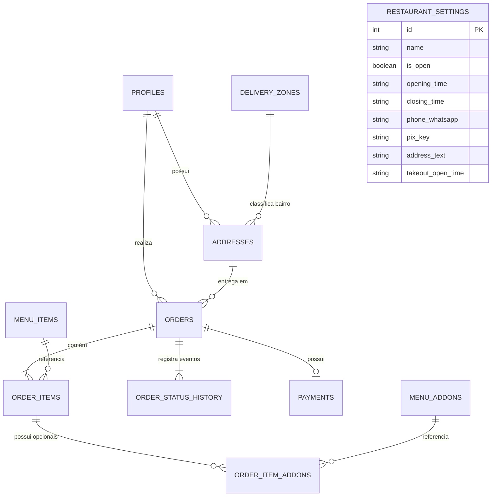

# Dicionário do Banco de Dados - Supabase / PostgreSQL

Este documento apresenta o mapeamento relacional completo do banco de dados PostgreSQL hospedado no Supabase para o ecossistema **Marmitex**.

---

## 1. Diagrama Entidade-Relacionamento (ERD)

---

## 2. Tipos Enumerados (Enums)

### 2.1 `MenuCategory`
| Valor | Descrição |
|---|---|
| `PRATO_DO_DIA` | Marmitex ou prato principal vinculado a dias específicos da semana. |
| `BEBIDA` | Sucos, refrigerantes, águas disponíveis todos os dias. |

### 2.2 `DayOfWeek`
| Valor | Descrição |
|---|---|
| `SEGUNDA` | Disponível na segunda-feira. |
| `TERCA` | Disponível na terça-feira. |
| `QUARTA` | Disponível na quarta-feira. |
| `QUINTA` | Disponível na quinta-feira. |
| `SEXTA` | Disponível na sexta-feira. |
| `SABADO` | Disponível no sábado. |
| `TODOS_OS_DIAS` | Disponível de segunda a sábado (geralmente bebidas e acompanhamentos padrão). |
| `DOMINGO` | Domingo (restaurante fechado para pedidos regulares). |

### 2.3 `DeliveryType`
| Valor | Descrição |
|---|---|
| `DELIVERY` | Entrega em domicílio (requer endereço e aplica taxa de entrega por bairro). |
| `TAKEOUT` | Retirada presencial no balcão do restaurante (frete R$ 0,00). |

### 2.4 `OrderStatus`
| Valor | Descrição |
|---|---|
| `PENDING` | Pedido registrado, aguardando confirmação ou aprovação do pagamento. |
| `CONFIRMED` | Pagamento aprovado ou pedido confirmado pelo atendente. |
| `IN_PREPARATION` | Na cozinha sendo montado/embalado. |
| `OUT_FOR_DELIVERY` | Despachado com o motoboy para entrega ou pronto para retirada. |
| `DELIVERED` | Concluído com sucesso (entregue ao cliente ou retirado). |
| `CANCELED` | Pedido cancelado pelo cliente ou pelo estabelecimento. |

### 2.5 `PaymentMethod`
| Valor | Descrição |
|---|---|
| `PIX` | Pagamento instantâneo PIX (QR Code e Copia e Cola EMV). |
| `CREDIT_CARD` | Cartão de crédito online via gateway. |
| `CASH_ON_DELIVERY` | Dinheiro físico no ato da entrega (suporta solicitação de troco). |
| `CARD_ON_DELIVERY` | Máquina de cartão levada pelo entregador. |

### 2.6 `PaymentStatus`
| Valor | Descrição |
|---|---|
| `PENDING` | Aguardando liquidação da transação. |
| `PAID` | Confirmado / Pago. |
| `FAILED` | Recusado ou com falha. |
| `CANCELED` | Transação cancelada ou estornada. |

---

## 3. Especificação das Tabelas

### 3.1 Tabela `profiles`
Armazena dados dos clientes e operadores do sistema.

| Coluna | Tipo | Nulo | Default | Descrição |
|---|---|---|---|---|
| `id` | `uuid` | Não | `gen_random_uuid()` | Chave primária. Identificador único do usuário. |
| `full_name` | `text` | Não | - | Nome completo do cliente ou atendente. |
| `phone` | `text` | Não | - | Telefone com DDD (chave de identificação do cliente sem login). |
| `role` | `text` | Não | `'CUSTOMER'` | Perfil de acesso (`'CUSTOMER'`, `'ADMIN'`, `'ATTENDANT'`). |
| `created_at` | `timestamptz` | Sim | `now()` | Data e hora de criação do cadastro. |
| `updated_at` | `timestamptz` | Sim | `now()` | Data e hora da última atualização. |

### 3.2 Tabela `addresses`
Endereços de entrega vinculados aos clientes.

| Coluna | Tipo | Nulo | Default | Descrição |
|---|---|---|---|---|
| `id` | `uuid` | Não | `gen_random_uuid()` | Chave primária do endereço. |
| `user_id` | `uuid` | Sim | `NULL` | FK para `profiles.id` (nulo caso pedido como visitante). |
| `street` | `text` | Não | - | Logradouro (Rua, Avenida, etc.). |
| `number` | `text` | Não | - | Número do imóvel ou "S/N". |
| `complement` | `text` | Sim | `NULL` | Apartamento, bloco, casa dos fundos, etc. |
| `neighborhood` | `text` | Não | - | Nome do bairro (utilizado para calcular frete em `delivery_zones`). |
| `city` | `text` | Não | `'São Paulo'` | Cidade de entrega. |
| `state` | `text` | Não | `'SP'` | UF da entrega. |
| `zip_code` | `text` | Sim | `NULL` | CEP do endereço. |
| `reference_point`| `text` | Sim | `NULL` | Ponto de referência para o entregador. |
| `is_default` | `boolean` | Não | `false` | Indica se é o endereço principal do cliente. |
| `created_at` | `timestamptz` | Sim | `now()` | Data de criação do registro. |

### 3.3 Tabela `delivery_zones`
Bairros atendidos e configuração das taxas de frete.

| Coluna | Tipo | Nulo | Default | Descrição |
|---|---|---|---|---|
| `id` | `uuid` | Não | `gen_random_uuid()` | Chave primária. |
| `neighborhood` | `text` | Não | - | Nome oficial do bairro atendido (único). |
| `delivery_fee` | `numeric(10,2)` | Não | `0.00` | Valor monetário cobrado pela entrega no bairro. |
| `estimated_time_min` | `integer` | Sim | `NULL` | Tempo estimado de entrega em minutos (ex: 45). |
| `is_active` | `boolean` | Não | `true` | Se falso, entregas para este bairro ficam desabilitadas. |
| `created_at` | `timestamptz` | Sim | `now()` | Data de cadastro da zona de entrega. |

### 3.4 Tabela `menu_items`
Itens do cardápio (pratos do dia e bebidas).

| Coluna | Tipo | Nulo | Default | Descrição |
|---|---|---|---|---|
| `id` | `uuid` | Não | `gen_random_uuid()` | Chave primária do prato/bebida. |
| `category` | `MenuCategory` | Não | `'PRATO_DO_DIA'` | Categoria do item (`PRATO_DO_DIA` ou `BEBIDA`). |
| `day_of_week` | `DayOfWeek` | Não | `'SEGUNDA'` | Dia em que o prato é servido ou `TODOS_OS_DIAS`. |
| `option_label` | `text` | Sim | `NULL` | Rótulo da opção (ex: `'1ª Opção'`, `'2ª Opção'`). |
| `name` | `text` | Não | - | Nome de exibição do prato (ex: `'Feijoada Completa'`). |
| `ingredients` | `text` | Sim | `NULL` | Descrição dos acompanhamentos e guarnições inclusas. |
| `has_salad` | `boolean` | Não | `true` | Indica se o prato inclui salada como opção padrão. |
| `price` | `numeric(10,2)` | Não | - | Preço base do prato (ex: 22.00). |
| `image_url` | `text` | Sim | `NULL` | URL pública da foto do prato hospedada no Supabase Storage. |
| `is_available` | `boolean` | Não | `true` | Se falso, o prato aparece como "Esgotado". |
| `display_order` | `integer` | Não | `0` | Ordem de exibição na listagem do cardápio. |
| `created_at` | `timestamptz` | Sim | `now()` | Data de cadastro do item. |
| `updated_at` | `timestamptz` | Sim | `now()` | Data da última alteração. |

### 3.5 Tabela `menu_addons`
Opcionais e acompanhamentos extras (ex: ovo frito, torresmo, batata frita).

| Coluna | Tipo | Nulo | Default | Descrição |
|---|---|---|---|---|
| `id` | `uuid` | Não | `gen_random_uuid()` | Chave primária do adicional. |
| `name` | `text` | Não | - | Nome do adicional (ex: `'Ovo Frito Extra'`). |
| `price` | `numeric(10,2)` | Não | - | Preço unitário do adicional (ex: 3.00). |
| `is_available` | `boolean` | Não | `true` | Disponibilidade do adicional no estoque. |
| `display_order` | `integer` | Não | `0` | Ordem de exibição nos modais de customização. |
| `created_at` | `timestamptz` | Sim | `now()` | Data de criação do registro. |

### 3.6 Tabela `orders`
Pedidos realizados no sistema.

| Coluna | Tipo | Nulo | Default | Descrição |
|---|---|---|---|---|
| `id` | `uuid` | Não | `gen_random_uuid()` | Chave primária do pedido. |
| `order_number` | `bigint` | Não | `IDENTITY` | Sequencial legível do pedido (ex: `1001`, `#1002`). |
| `customer_id` | `uuid` | Sim | `NULL` | FK para `profiles.id`. |
| `delivery_type` | `DeliveryType` | Não | `'DELIVERY'` | Modalidade de entrega (`DELIVERY` ou `TAKEOUT`). |
| `address_id` | `uuid` | Sim | `NULL` | FK para `addresses.id` (nulo em retiradas). |
| `takeout_time` | `text` | Sim | `NULL` | Horário previsto para retirada presencial (ex: `'12:30'`). |
| `status` | `OrderStatus` | Não | `'PENDING'` | Estado atual do pedido na máquina de estados. |
| `subtotal` | `numeric(10,2)` | Não | `0.00` | Soma dos valores dos itens e adicionais recalculada pelo servidor. |
| `delivery_fee` | `numeric(10,2)` | Não | `0.00` | Taxa de entrega calculada via `delivery_zones` (0 se retirada). |
| `discount` | `numeric(10,2)` | Não | `0.00` | Valor de desconto aplicado (cupons ou cortesias). |
| `total_amount` | `numeric(10,2)` | Não | `0.00` | Valor final do pedido (`subtotal + delivery_fee - discount`). |
| `payment_method`| `PaymentMethod`| Não | - | Meio de pagamento escolhido. |
| `need_change` | `boolean` | Não | `false` | Indica se o cliente precisa de troco (em pagamento em dinheiro). |
| `change_for` | `numeric(10,2)` | Sim | `NULL` | Valor para o qual o motoboy deve levar troco. |
| `notes` | `text` | Sim | `NULL` | Observações gerais do cliente sobre a entrega ou pedido. |
| `created_at` | `timestamptz` | Sim | `now()` | Data e hora de criação do pedido. |
| `updated_at` | `timestamptz` | Sim | `now()` | Data e hora da última modificação do pedido. |

### 3.7 Tabela `order_items`
Itens vinculados a um pedido específico.

| Coluna | Tipo | Nulo | Default | Descrição |
|---|---|---|---|---|
| `id` | `uuid` | Não | `gen_random_uuid()` | Chave primária do item do pedido. |
| `order_id` | `uuid` | Não | - | FK para `orders.id`. |
| `menu_item_id` | `uuid` | Não | - | FK para `menu_items.id`. |
| `item_name` | `text` | Não | - | Nome congelado do prato no momento da compra. |
| `option_label` | `text` | Sim | `NULL` | Rótulo congelado (ex: `'1ª Opção'`). |
| `day_name` | `text` | Sim | `NULL` | Dia da semana congelado (ex: `'QUARTA'`). |
| `has_salad` | `boolean` | Não | `true` | Indica se o cliente optou por receber a salada. |
| `quantity` | `integer` | Não | `1` | Quantidade solicitada do prato. |
| `unit_price` | `numeric(10,2)` | Não | - | Preço unitário base no momento do pedido. |
| `preferences` | `text` | Sim | `NULL` | Preferências do cliente (ex: "sem feijão por cima do arroz"). |
| `total_price` | `numeric(10,2)` | Não | - | Valor total deste item com adicionais multiplicados pela quantidade. |
| `created_at` | `timestamptz` | Sim | `now()` | Data de inserção do registro. |

### 3.8 Tabela `order_item_addons`
Adicionais associados a um item específico do pedido.

| Coluna | Tipo | Nulo | Default | Descrição |
|---|---|---|---|---|
| `id` | `uuid` | Não | `gen_random_uuid()` | Chave primária. |
| `order_item_id`| `uuid` | Não | - | FK para `order_items.id`. |
| `addon_id` | `uuid` | Não | - | FK para `menu_addons.id`. |
| `addon_name` | `text` | Não | - | Nome congelado do adicional no momento da compra. |
| `price` | `numeric(10,2)` | Não | - | Preço unitário congelado do adicional. |
| `created_at` | `timestamptz` | Sim | `now()` | Data de criação do registro. |

### 3.9 Tabela `order_status_history`
Trilha de auditoria das mudanças de status de cada pedido.

| Coluna | Tipo | Nulo | Default | Descrição |
|---|---|---|---|---|
| `id` | `uuid` | Não | `gen_random_uuid()` | Chave primária. |
| `order_id` | `uuid` | Não | - | FK para `orders.id`. |
| `from_status` | `text` | Sim | `NULL` | Status anterior (ou `NULL` na criação). |
| `to_status` | `text` | Não | - | Novo status assumido pelo pedido. |
| `notes` | `text` | Sim | `NULL` | Motivo ou observação da alteração (ex: "Saiu para entrega com Motoboy Lucas"). |
| `created_at` | `timestamptz` | Sim | `now()` | Timestamp da alteração de status. |

### 3.10 Tabela `payments`
Registro de transações financeiras e dados de pagamento eletrônico.

| Coluna | Tipo | Nulo | Default | Descrição |
|---|---|---|---|---|
| `id` | `uuid` | Não | `gen_random_uuid()` | Chave primária da transação de pagamento. |
| `order_id` | `uuid` | Não | - | FK para `orders.id`. |
| `provider` | `text` | Não | `'PIX_BACEN'` | Provedor de pagamento (`'PIX_BACEN'`, `'MERCADO_PAGO'`, etc.). |
| `external_id` | `text` | Sim | `NULL` | Identificador na ponta externa ou `txId` do PIX. |
| `status` | `PaymentStatus`| Não| `'PENDING'` | Situação do pagamento (`PENDING`, `PAID`, `FAILED`, `CANCELED`). |
| `qr_code_pix` | `text` | Sim | `NULL` | String do payload Pix Copia e Cola formatada conforme padrão EMV. |
| `paid_at` | `timestamptz` | Sim | `NULL` | Data e hora em que a confirmação de pagamento foi recebida. |
| `created_at` | `timestamptz` | Sim | `now()` | Data de abertura da transação. |
| `updated_at` | `timestamptz` | Sim | `now()` | Data da última atualização de status. |

### 3.11 Tabela `restaurant_settings`
Configurações operacionais únicas do estabelecimento.

| Coluna | Tipo | Nulo | Default | Descrição |
|---|---|---|---|---|
| `id` | `integer` | Não | `1` | Chave primária (normalmente linha única com ID 1). |
| `name` | `text` | Não | `'Marmitaria do Dia'` | Nome comercial do restaurante. |
| `is_open` | `boolean` | Não | `true` | Interruptor mestre manual (liga/desliga pedidos). |
| `opening_time` | `text` | Não | `'11:00'` | Horário de início de atendimento (formato HH:mm). |
| `closing_time` | `text` | Não | `'14:30'` | Horário de término de atendimento (formato HH:mm). |
| `phone_whatsapp`| `text` | Não | - | WhatsApp oficial para contato com clientes. |
| `pix_key` | `text` | Não | - | Chave PIX oficial (e-mail, CPF/CNPJ, telefone ou EVP). |
| `address_text` | `text` | Não | - | Endereço físico da marmitaria para retirada presencial. |
| `takeout_open_time`| `text`| Sim | `'11:00'` | Horário a partir do qual retiradas no balcão são aceitas. |
| `updated_at` | `timestamptz` | Sim | `now()` | Data da última alteração de configurações. |
