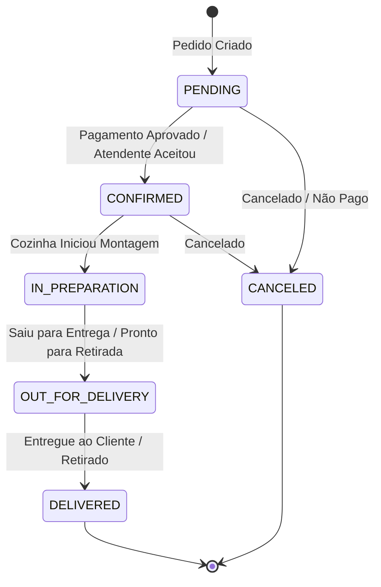
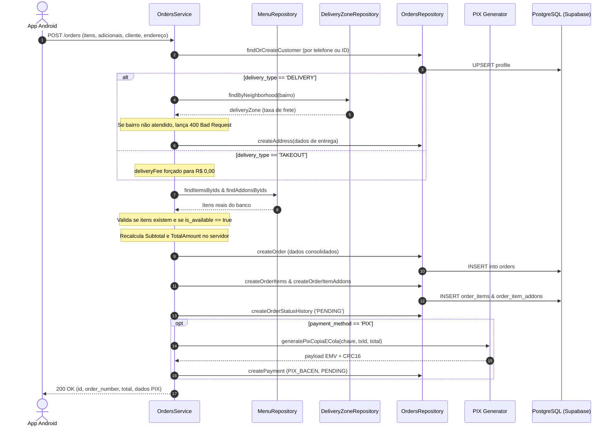

# Módulo: Pedidos & Checkout (`orders`)

O módulo **`orders`** é o núcleo transacional do sistema. Ele gerencia o carrinho de compras, recálculo seguro de valores, persistência relacional do pedido, itens e opcionais, máquina de estados do pedido e auditoria de histórico.

---

## 1. Estrutura de Arquivos

```
src/modules/orders/
├── orders.controller.ts   # Handlers HTTP para criação, consulta e atualização de status
├── orders.repository.ts   # Operações transacionais no Supabase (orders, items, history)
├── orders.routes.ts       # Rotas Fastify (POST /orders, GET /orders/:id, PATCH /orders/:id/status)
├── orders.schema.ts       # Schemas Zod com refinamento condicional (superRefine)
└── orders.service.ts      # Regras de negócio, recálculo de valores e orquestração de PIX
```

---

## 2. Máquina de Estados do Pedido (*Order State Machine*)

O ciclo de vida de um pedido transita pelos seguintes estados bem definidos:



Toda transição de estado registra compulsoriamente uma entrada na tabela `order_status_history` contendo o status anterior, o novo status, data/hora e observações da operação.

---

## 3. Fluxo de Criação de Pedido (`POST /orders`)

O método `OrdersService.createOrder` implementa um pipeline estrito em 9 etapas:



---

## 4. Classes e Métodos

### 4.1 `OrdersController` (`src/modules/orders/orders.controller.ts`)
- `async createOrder(request: FastifyRequest, reply: FastifyReply)`: Recebe `CreateOrderInput` validado e retorna o pedido criado com dados de PIX (se aplicável).
- `async getOrderById(request: FastifyRequest, reply: FastifyReply)`: Extrai `:id` dos parâmetros da rota e retorna a árvore completa do pedido.
- `async updateOrderStatus(request: FastifyRequest, reply: FastifyReply)`: Atualiza o status do pedido a partir do painel da cozinha (`PATCH /orders/:id/status`).

### 4.2 `OrdersService` (`src/modules/orders/orders.service.ts`)
- **`async createOrder(input: CreateOrderInput)`**:
  - **Validação de Troco:** Se `payment_method === 'CASH_ON_DELIVERY'` e `need_change === true`, valida se `change_for > totalAmount`. Se o troco for menor ou igual ao valor total do pedido, rejeita a requisição.
  - **Preços Confiáveis:** Nunca lê valores monetários enviados pelo cliente. Os preços unitários dos pratos e adicionais vêm exclusivamente das consultas às tabelas `menu_items` e `menu_addons`.
  - **Arredondamento:** Todos os cálculos parciais e finais utilizam arredondamento financeiro de 2 casas decimais (`toFixed(2)`).
- **`async getOrderById(id: string)`**:
  - Consulta `order`, `customer`, `address`, `order_items` (com seus respectivos `order_item_addons`), `payment` e `order_status_history`. Lança `NotFoundError` caso o pedido não exista.
- **`async updateOrderStatus(id: string, newStatus: OrderStatus, notes?: string)`**:
  - Atualiza o registro em `orders` e insere um evento em `order_status_history`.

### 4.3 `OrdersRepository` (`src/modules/orders/orders.repository.ts`)
- `findOrCreateCustomer(data)`: Busca perfil pelo ID ou telefone formatado. Se inexistente, insere novo registro com `role = 'CUSTOMER'`.
- `createAddress(addressData)`: Insere novo endereço na tabela `addresses`.
- `getAddressById(id)`: Localiza endereço existente.
- `createOrder(orderData)`: Insere cabeçalho do pedido na tabela `orders`.
- `createOrderItems(items)`: Insere lote de itens do pedido na tabela `order_items`.
- `createOrderItemAddons(addons)`: Insere lote de adicionais na tabela `order_item_addons`.
- `createOrderStatusHistory(data)`: Registra log de auditoria na tabela `order_status_history`.
- `getOrderCompleteDetails(id)`: Executa consultas paralelas otimizadas para montar o DTO completo do pedido.
- `updateOrderStatus(id, status)`: Atualiza a coluna `status` de um pedido existente.

---

## 5. Validação Zod Avançada (`orders.schema.ts`)

O schema de criação de pedido aplica regras condicionais usando `.superRefine()`:

```typescript
export const createOrderInputSchema = z
  .object({
    customer: orderCustomerSchema,
    delivery_type: z.enum(['DELIVERY', 'TAKEOUT']),
    address_id: z.string().uuid().optional(),
    address: orderAddressSchema.optional(),
    takeout_time: z.string().optional(),
    items: z.array(orderItemInputSchema).min(1, 'O pedido deve conter ao menos 1 item'),
    payment_method: z.enum(['PIX', 'CREDIT_CARD', 'CASH_ON_DELIVERY', 'CARD_ON_DELIVERY']),
    need_change: z.boolean().default(false),
    change_for: z.number().positive().nullable().optional(),
    notes: z.string().max(500).nullable().optional(),
  })
  .superRefine((data, ctx) => {
    // Regra 1: Se for entrega, é obrigatório informar o objeto address ou um address_id existente
    if (data.delivery_type === 'DELIVERY') {
      if (!data.address_id && !data.address) {
        ctx.addIssue({
          code: z.ZodIssueCode.custom,
          message: 'Para entrega (DELIVERY), informe um address_id ou preencha o objeto address',
          path: ['address'],
        });
      }
    }

    // Regra 2: Se for pagamento em dinheiro com troco, o valor change_for é obrigatório
    if (data.payment_method === 'CASH_ON_DELIVERY' && data.need_change) {
      if (!data.change_for) {
        ctx.addIssue({
          code: z.ZodIssueCode.custom,
          message: 'Informe o valor para troco em change_for quando need_change for verdadeiro',
          path: ['change_for'],
        });
      }
    }
  });
```
